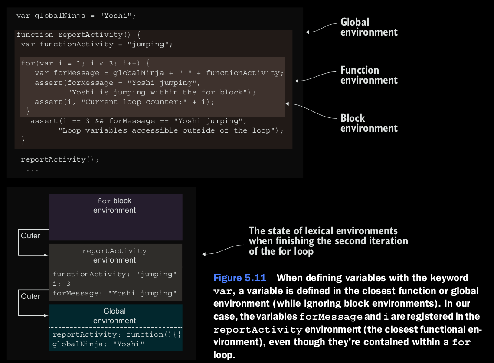

### Variable definition keywords and lexical enviroments.

Los tres tipos de deficion de variables --var, let, y const --pueden tambien ser categorizados por su 
relacion con su ambiente lexico (en otras palabras, por su scope). En ese caso, podemos poner 'var'
en un lado y let and cost en otro caso.

#### Using  the 'var' keyword.

Cuando usamos la palabra 'var', la variable es definida en la funcion mas cercana o en el ambiente lexico
global. (Note que los bloques son ignorados) Esto es de larga data en Javascript que ha disparado a muchos
desarrolladores que vienen de otros lenguajes.
considere el siguiente codigo.
```
function assert(value, description) {
    var result = value ? "pass" : "fail";
    console.log(result + ' - ' +  description);
};


var globalNinja = "Joshi";

function reportActivity() {
    var functionActivity = "jumping";

    for(var i = 1; i < 3; i++) {
        var forMessage = globalNinja + " " + functionActivity;
        assert(forMessage === "Joshi jumping", "Joshi is jumping within the for block");
        assert(i, "Current loop counter: " + i);
    }

    assert(i === 3 && forMessage === "Yoshi jumping", "Loop variables accesible outsite of the loop");
}
reportActivity();

assert(typeof functionActivity === "undefined"
    && typeof i === "undefined" && typeof forMessage === "undefined",
    "We cannot see function variables outside of a function");
```

Empezamos por definir una variable global, globalNinja, la cual es seguiguida por una funcion llamada reportActivity, 
que hace un loop 2 veces y notifica acerca la actividad de jumping de nuestro variable global globalNinja. Como usted 
puede ver, dentro del cuerpo del for loop, podemos accesar normalmente ambas variables del bloque (*i* y *forMessage*) 
Pero que es extrano en javascript, y que es lo que confunde a muchos desarrolladores que vienen de otras lenguas, es 
que podemos accesar las variables definidas (*functionActivity*) y la variable global (*globalNinja*).
Pero lo que es confuso con Javascript  y lo que confude a muchos desarrollaores que vienen de otros lenguajes, es que 
podemos accesar variables definidas con bloques de codigo inclusive afuera de esos bloques.

```
assert(i === 3 && forMessage === "Yoshi jumping",
"Loop variables accessible outside of the loop");
```

Esto es asi por el motivo de que las varaibles declaradas con *var* son siempre registradas en la funcion mas cercana 
o en el ambiente global, sin poner atencion a los bloques. La figura 5.11 muestra esta situacion, mostrando el estado 
de los ambientes lexicos despues del segunda iteracion del for loop en la funcion reportActivity.



