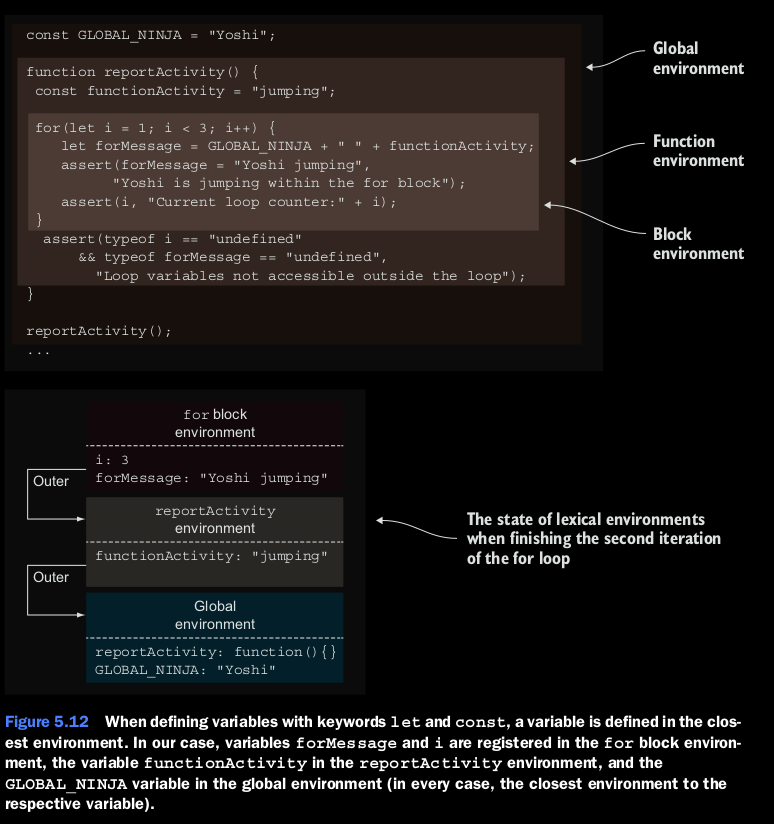

### Variable definition keywords and lexical enviroments.

Los tres tipos de deficion de variables --var, let, y const --pueden tambien ser categorizados por su 
relacion con su ambiente lexico (en otras palabras, por su scope). En ese caso, podemos poner 'var'
en un lado y let and cost en otro caso.

#### Using  the 'var' keyword.

Cuando usamos la palabra 'var', la variable es definida en la funcion mas cercana o en el ambiente lexico
global. (Note que los bloques son ignorados) Esto es de larga data en Javascript que ha disparado a muchos
desarrolladores que vienen de otros lenguajes.
considere el siguiente codigo.
```
function assert(value, description) {
    var result = value ? "pass" : "fail";
    console.log(result + ' - ' +  description);
};


var globalNinja = "Joshi";

function reportActivity() {
    var functionActivity = "jumping";

    for(var i = 1; i < 3; i++) {
        var forMessage = globalNinja + " " + functionActivity;
        assert(forMessage === "Joshi jumping", "Joshi is jumping within the for block");
        assert(i, "Current loop counter: " + i);
    }

    assert(i === 3 && forMessage === "Yoshi jumping", "Loop variables accesible outsite of the loop");
}
reportActivity();

assert(typeof functionActivity === "undefined"
    && typeof i === "undefined" && typeof forMessage === "undefined",
    "We cannot see function variables outside of a function");
```

Empezamos por definir una variable global, globalNinja, la cual es seguiguida por una funcion llamada reportActivity, 
que hace un loop 2 veces y notifica acerca la actividad de jumping de nuestro variable global globalNinja. Como usted 
puede ver, dentro del cuerpo del for loop, podemos accesar normalmente ambas variables del bloque (*i* y *forMessage*) 
Pero que es extrano en javascript, y que es lo que confunde a muchos desarrolladores que vienen de otras lenguas, es 
que podemos accesar las variables definidas (*functionActivity*) y la variable global (*globalNinja*).
Pero lo que es confuso con Javascript  y lo que confude a muchos desarrollaores que vienen de otros lenguajes, es que 
podemos accesar variables definidas con bloques de codigo inclusive afuera de esos bloques.

```
assert(i === 3 && forMessage === "Yoshi jumping",
"Loop variables accessible outside of the loop");
```

Esto es asi por el motivo de que las varaibles declaradas con *var* son siempre registradas en la funcion mas cercana 
o en el ambiente global, sin poner atencion a los bloques. La figura 5.11 muestra esta situacion, mostrando el estado 
de los ambientes lexicos despues del segunda iteracion del for loop en la funcion reportActivity.


Aqui tenemos tres ambientes lexicos.
* El ambiente global en el cual la variable globalNinja esta registrada (porque esta esta mas cerca a funcion global o 
el ambiente global).
* El ambiente de la funcion reportActivity, creado en la invocacion de la funcion reportActivity, la cual contiene la 
variable *functionActivity*, la variable *i*, y las variables *forMessage*, por que ellas estan definidas con la 
palabra *var* y este es ambiente de funcion mas cercano.
* El ambiente lexico del for loop, el cual esta vacio, por que la deficion de *var* ignora bloques (inclusive cuando 
esten dentro de ellos).

Por el motivo de esta comportamiento, la version de ES6 de Javascript ofrece dos nuevas declaraciones de variables:
*let* y *const*

#### Using  the 'let' keyword.
A diferencia de *var*, que define la variable en la funcion mas cercana o el ambiente lexico global, *let* y *const* 
son mas directas. Ellas defien variables en el ambiente lexico mas cercano (que podria ser un ambiente de un bloque, 
el ambiente de una funcion, o inclusive el ambiente global). Podemos usar *let*  y *const* para definir scopes de 
bloques, scopes de funciones, y scopes globales.
Vamos a rescrbir nuestro ejemplo anterior utilizando *const* y *let*.

```
function assert(value, description) {
    var result = value ? "pass" : "fail";
    console.log(result + ' - ' +  description);
}

const GLOBAL_NINJA  = 'Yoshi';

function reportActivity() {
    const functionActivity = 'jumping';

    for(let i = 1; i < 3; i++) {
        let forMessage = GLOBAL_NINJA + " " + functionActivity;
        assert(forMessage === "Yoshi jumping",
            "Yoshi is jumping within the for block");
        assert(i, "Current loop counter:" + i);
    }

    assert(typeof i === "undefined" && typeof forMessage === "undefined",
        "Loop variables not accessible outside the loop");
}

reportActivity();

assert(typeof functionActivity === "undefined"
    && typeof i === "undefined" && typeof forMessage === "undefined",
    "We cannot see function variables outside of a function");
```
La figura 5.12 ilustra la situacion actual, cuando se esta terminando la ejecucion de la segunda iteracion del loop 
for en la funcion reportActivity. De nuevo tenemos tres ambientes lexicos, el ambiente de la funcion reportActivity,
el ambiente global, el ambiente del bloque del for loop. Pero por que estamos usando *let*  y *const* , las variables 
estan siendo definidas en su ambiente lexico mas cercano; la variable GLOBAL_NINJA esta definida en el ambiente global 
la variable functionActivity esta en el ambiente de la funcion reportActivity, y la *i*  y *forMessage* estan en el 
bloque del ambiente del for loop.
Ahora que *const* y *let*  han sido introducidos, desarrolladores que vengan de otros lenguajes puden estar mas 
tranquilos. Javascript finalmente soporta las mismas reglas de scope de otros lenguajes C-Like. Por esta razon, desde 
el punto de vista de este libro, casi siempre usamos let y cont en vez de var.

Ahora que entendemos como identificar mapas y mantener ambientes lexicos y como los ambientes lexicos entan ligados a 
la ejecucion de un programa, vamos a discutir el proceso exacto en el cual los identificadores son definidos dentro 
de ambientes lexicos. Esto nos va ayudar a un entendimiento de algunos bugs comunes.