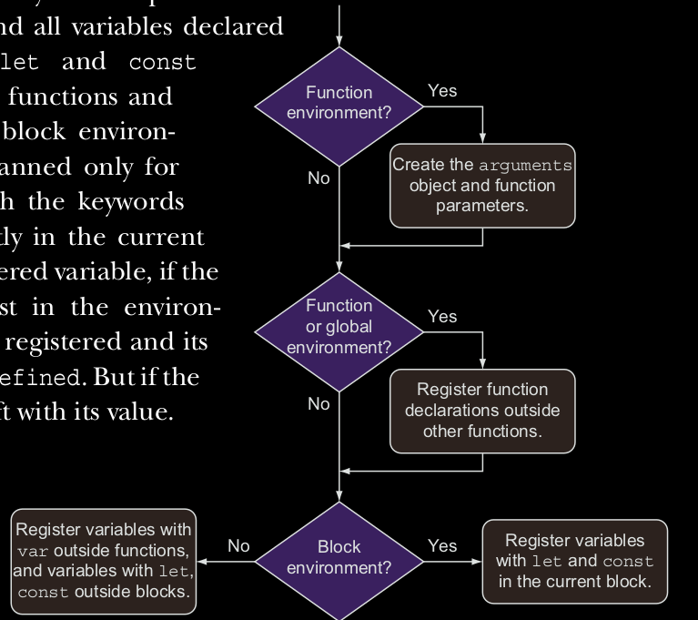

### Registering identifiers within lexical environments

Uno de los principios dentras del diseno de Javascript como lenguaje, fue su facilidad de uso. Esa es una de las 
razones por lo cual no especificar *return types*, tipos de parametros, tipos de variables, etc... Y usted ya sabe 
que el codigo en Javascript se ejecuta linea por linea, de una manera directa. Considere lo siguiente:
```
firstRonin = "Kiyokawa";
secondRonin = "Kondo";
```
El valor de *Kiyokawa* es asignado a un identificador *firstRonin*, y despues el valor *Kondo* es asignado al 
identificador *secondRonin*. No hay nada raro con eso cierto? Pero vea el siguiente ejemplo.
 
 ```
 const firstRonin = "Kiyokawa"
 check(firstRonin);
 function check(ronin) {
   assert(ronin === "Kiyokawa", "The roning was checked");
 }
```
En este caso, asignamos el valor de *Kiyokawa* al identificador *firstRonin*, y despues cuando llamamos a la funcion 
*check* con el identificador *firstRonin* como un parametro. Pero mantiene por un segundo -- si el codigo es ejecutado 
linea por linea, deberiamos de poder llamar la funcion *check*? La ejecucion de nuestro programa no a alcanzado su 
declaracion, entonces el Motor de Javascript no deberia saber hacerca de esto.
Pero si *check*, como se muestra en la figura 5.13, usted puede ver que todo esta bien. Javascript no es muy picky 
acerca donde definimos nuestras funciones. Podemos escoger declaraciones de funciones antes o despues de las llamadas. 
Esto no es algo que los desarrolladores deben hacer escando acerca.

#### El proceso de registrar identificadores.
Pero deje la facilidad de un lado, si el codigo es ejecutado linea por linea, como hace el motor de Javascript sabe que 
una funcion *check* es nombrada y existe? Resula que el motor de Javascript hace un poco de trampa, y esa ejecucion 
de Javascript ocurre en dos faces.
La primera fase es activada cuando cualquier ambiente lexico es creado. En esta face, el codigo no fue ejecutado,
pero el motor de Javascript visita y registra todas las variables declaradas y funciones dentro del ambiente lexico 
al corriente. La segunda fase, la ejecucion en javascript, comienza cuando esta se ha completado; el comportamiento
depende en el tipo de variable (let, var, const, y declaracion de funciones) y el tipo de ambiente (global, 
funciones o blques).

El proceso es de la siguiente manera:

1. Si estamos creando un ambiente de una funcion, el implicito identificador *arguments* es creado, con todos los 
parametros de la funcion y los valores de los argumentos. Si estamos lideando con una no-funcion este paso no lo hara.

2. Si estamos creando un ambiente global o el ambiente de una funcion, el codigo al corriente es escaneado ( sin ir 
al cuerpo de otras funciones ), por funciones declaradas ( pero las no-funciones expresiones o funciones arrow). Por 
cada funcion declarada descubierta, una nueva funcion es creada y es ligada a un identificador en el ambiente con el
nombre de la funcion. Si ese nombre de identificador ya existe, su valor es sobreescrito. Si estamos lideando con 
ambientes de bloque este paso es omitido.

3. El codigo al corriente es escaneado por declaracion de variables. En ambiente de funciones y ambientes globales 
todas las variables declaradas con la palabra *var* y definidas fuera de otras funciones (per ellas pueden ser 
declaradas dentro de bloques!) son encontradas, y todas las variables declaradas con las palabras *let* y *const* 
directamente en el bloque al corriente. Por cada variable descubierta, si el identificador no existe en el ambiente, 
el identificador es registrado y su valor es inicializado como undefined. Pero si el identificador existe, se deja 
en el valor.



### Calling functions before their declarations.
Uno de las caracteristicas que hace interesante a Javascript es el orden de la definicion de las funciones sin importar.
Aquellos que hayan utilizado pascal talvez no lo recuerden su estructuramiento rigido. El Javascript, podemos llamar las 
funciones antes de que sean declaradas. Mire el siguiente ejemplo a continuacion.

```
assert(typeof fun === 'function', 'Fun es una funcion inclusive si no ha sido alcanzada aun' );
assert(typeof myFuncExp === 'undefined', "Pero no podemos accesar funciones expresadas");
assert(typeof myArrow === 'undefined', "Las arrow functions tampoco");
```
Podemos accesar a la funcion *fun* inclusive antes de que sea definida. Podemos hacer esto por que la funcion *fun* 
esta declarada como una funcion declarada, y el segundo paso (listado previamente en esta seccion ) indica que las 
funciones creadas como funciones declaradas son creadas y sus identificadores registrados cuando el ambiente lexico 
al corriente es creado, antes de que cualquier codigo de Javascript sea ejecutado. Entonces inclusive antes de que 
empezemos ejecutando la llamada de nuestra funcion assert, la funcion fun ya existe. 

El motor de Javascript hace esto para hacer las cosas mas faciles para nosotros como desarrolladores, permitiendonos 
usar una referencia directa y para no estar cargandonos con un orden exacto para el llamado de las funciones. Las 
funciones ya existen. Las funciones que ya existen al momento de que nuestro codigo sea ejecutado.
Note que esto solo se mantiene con las funciones que son declaradas. Las funciones expresadas y las funciones arrow 
no son parte de este proceso, y so creadas cuando la ejecucion del programa alcanza sus definiciones. Por esto es el 
motivo por el cual no se pueden accesar a las funciones myFuncExp y myArrow.

### Sobreescribiendo funciones
La siguiente adivinanza a atacar es el problema de sobreescribir los identificadores de las funciones. Vamos a ver otro 
ejemplo.

```
assert(typeof fun === "function", "Accesamos a la funcion");
var fun = 3; // Define una variable fun y le asigna un numero

assert(typeof fun === "number", "Ahora lo podemos accesar por medio de un numero");

function fun(){}; // Una funcion declarada

assert(typeof === "number", "Still a number");
```
En este ejemplo, una variable declarada y una funcion declarada que tienen el mismo nombre *fun*. Si usted corre este 
codigo, usted va a ver que ambos assert van a pasar. En el primer assert, el identificador *fun* se refiere a una 
funcion; en la segunda y en la tercera, *fun* se refiere a un numero.
Este comportamiento prosigue como una directa consecuencia de los pasos tomados cuando registramos identificadores. En 
el segundo paso del proceso que ya fue dibujado, funciones definidas con funciones declaradas son creadas y asociadas 
a estos identificadores que todavia no han sido encontrados en el segundo paso, y el el tercer paso, la declaracion 
de variables es lo que procede, y el valor *undefined* es asociado a identificadores que todavia no han sido encontrados 
en el ambiente al corriente.
En este caso, por que el identificador *fun*  ha sido encontrado en el segundo paso cuando la declaracion de las 
funciones son registradas, el valor de *undefined*  no ha sido asignado a la variable *fun*. Esta es la razon por la 
cual el primer assert, a la hora de ser testeado *fun* retorna un pass como si fuera una funcion. Despues de eso, 
hemos asignado una sentencia, *var fun = 3*, el cual asigna el numero 3 al identificador *fun*. Al hacer esto, 
perdemos la referencia de la funcion, y de ahi en adelante, el identificador *fun*  hace referencia al numero y no a la
funcion.

Durante la ejecucion del programa actual, la declaracion de las funciones son omitidas, entonces la definicion de la 
funcion *fun* no tiene ningun impacto en el valor del indentificador *fun*.

#### Variable hoisting
Si usted ha leido muchos blogs de Javascript o libros explicando la resolucion de los indentificadores, probablemente 
usted ha escuchado del termino hoisting --por ejemplo, variables y la declaracion de las funciones estan hoisted o estan 
recogidas, al la parte mas alta de una funcion o el scope global.
Como usted ha visto, sin embargo, es una vista simplista. Las variables y funciones declaradas no son movidas a 
cualquier lado tecnicamente. Ellas son visitadas y registradas en ambientes lexicos antes de que el codigo sea ejecutado.
Aunque el hoisting, como en la mayoria del tiempo es definido, es suficiente para proveer un entendimiento en como 
los scopes de Javascript funcionan, hemos ido mas profundo que mirar ambientes lexicos, tomando otro paso en el camino 
de volvernos Javascript Ninjas de verdad.
En la siguiente sexion, todos los conceptos que hemos explorado hasta ahora en este capitulo nos va a ayudar a entender 
los clousures.


 


