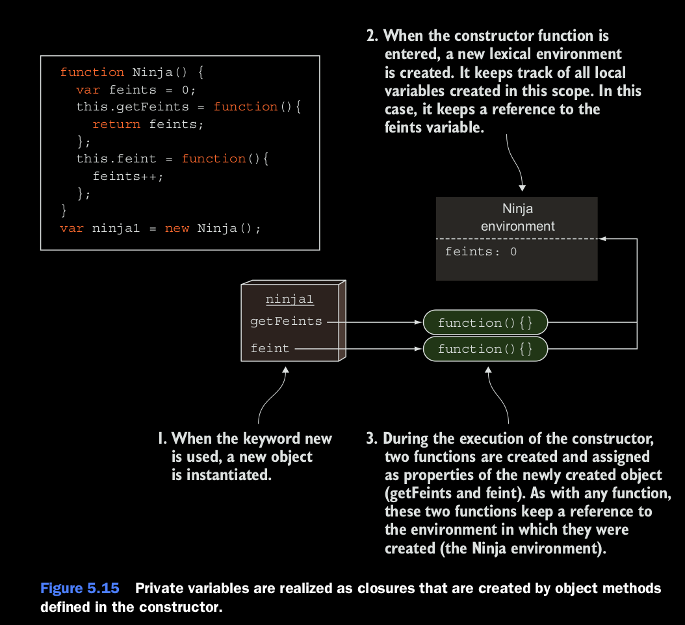

### Revisting mimicking private variables with clousures.

Como usted ya ha visto, los closures nos pueden ayudar a imitar variables privadas. Ahora que tenemos un entendimiento 
solido en como el las reglas de scoping funcionan en Javascript. vamos a revisar el ejemplo de variables privadas. Esta 
vez nos vamos a enfocar en la ejecucion del contexto y ambientes lexicos. Solo para hacer las cosas mas faciles. Vamos a 
repetir el listing

#### Listing 5.11 Approximate private variables clousures.
```
// Declara una variable dentro de un constructor. Por que el scope de las variables es limitado dentro del constructor,
// y dentro de ese scope son privadas.

function Ninja() {
    var feints = 0;
    //Un metodo que retorna el contador de feints
    this.getFeints = function() {
        return feints;
    };
    // El metodo que va incrementando el valor. Por que el valor es privado, nadie puede tocarlo de alguna manera
    //
    this.feint = function() {
        feints++;
    }
}

var ninja1 = new Ninja();
// verify that we cannot access to variables
assert(ninja1.feints === undefined, "And the private date is not accesible to us");

// Llama al metodo feint, wel cual incrementa la cuenta del numero de veces que el ninja a feinted.
ninja1.feint();

// Prueba que el incremento se ha hecho.
assert(ninja1.getFeints() === 1, "Ahora estamos avilitidaos a tener el count tde fetins");

// Cuando creamos un nuevo objeto con ninja2, con el constructor Ninja, el objeto ninja2 tiene su propia variable
// feints
var ninja2 = new Ninja();
assert(ninja2.getFeints() === 0, "El ninja2 tiene su propia variable feints");

```



Ahora vamos analizar el estado de la aplicacion despues del primer objeto *Ninja* ha sido creado, como se muestra en la 
figura 5.15. Podemos usar nuestro conocimiento para las complegidades de la resolucion de identificadores para un mejor 
entendimiento en como los clousures juegan en esta situacion, los constructores de Javascript son funciones invocadas 
con el la palabra *new*. Por lo tanto, cada momento que invoquemos una funcion constructora, creamos un nuevo ambiente 
lexico, que mantiene 

