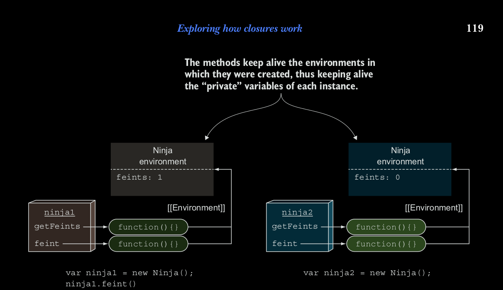

### Revisting mimicking private variables with clousures.

Como usted ya ha visto, los closures nos pueden ayudar a imitar variables privadas. Ahora que tenemos un entendimiento 
solido en como el las reglas de scoping funcionan en Javascript. vamos a revisar el ejemplo de variables privadas. Esta 
vez nos vamos a enfocar en la ejecucion del contexto y ambientes lexicos. Solo para hacer las cosas mas faciles. Vamos a 
repetir el listing

#### Listing 5.11 Approximate private variables clousures.
```
// Declara una variable dentro de un constructor. Por que el scope de las variables es limitado dentro del constructor,
// y dentro de ese scope son privadas.

function Ninja() {
    var feints = 0;
    //Un metodo que retorna el contador de feints
    this.getFeints = function() {
        return feints;
    };
    // El metodo que va incrementando el valor. Por que el valor es privado, nadie puede tocarlo de alguna manera
    //
    this.feint = function() {
        feints++;
    }
}

var ninja1 = new Ninja();
// verify that we cannot access to variables
assert(ninja1.feints === undefined, "And the private date is not accesible to us");

// Llama al metodo feint, wel cual incrementa la cuenta del numero de veces que el ninja a feinted.
ninja1.feint();

// Prueba que el incremento se ha hecho.
assert(ninja1.getFeints() === 1, "Ahora estamos avilitidaos a tener el count tde fetins");

// Cuando creamos un nuevo objeto con ninja2, con el constructor Ninja, el objeto ninja2 tiene su propia variable
// feints
var ninja2 = new Ninja();
assert(ninja2.getFeints() === 0, "El ninja2 tiene su propia variable feints");

```


Ahora vamos analizar el estado de la aplicacion despues del primer objeto *Ninja* ha sido creado, como se muestra en la 
figura 5.15. Podemos usar nuestro conocimiento para las complegidades de la resolucion de identificadores para un mejor 
entendimiento en como los clousures juegan en esta situacion, los constructores de Javascript son funciones invocadas 
con el la palabra *new*. Por lo tanto, cada momento que invoquemos una funcion constructora, creamos un nuevo ambiente 
lexico, que mantiene un rastreo de variables en un constructor local. En este ejemplo, un nuevo ambiente Ninja que 
mantiene el rastrode la variable feints.
En adicion,m dondequiera que una funcion es creada, mantiene referencia del ambiente lexico en el cual es creado ( 
atravez de la propiedad interna [[Enviroment]] ). En este caso, dentro de la funcion constructora Ninja, creamos dos 
nuevas funciones: getFetins and feint, las cuales mantinen referencia al ambiente de Ninja, por que este es el ambiente 
del cual ellas fueron creadas.
Las funciones getFeints y feint son asignadas por metodos del nuevo objeto ninja creado (el cual, si usted recuerda de 
capitulos anteriores, es accesible por medio de la palabra *this* ). Por lo tanto getFeints y feint van hacer accecibles 
desde afuera de la funcion constructura Ninja, que a su vez conduce al hecho  de que usted ya ha creado efectivamente 
un clousure alrededor de la variable feints.




Cuando creamos otro objeto Ninja, el objeto ninja2, todo el proceso es repetido. En la figura 5.16 muestra el estado de 
la aplicacion despues de crear el segundo objeto Ninja.
Cada objeto creado  de el constructor Ninja obtiene sus propios metodos (el ninja.getFeints metodo es diferente de el 
ninja2.getFeints metodo) que cerca las variables definido cuando el constructor es invocado. Estas variables 'privadas' 
son accesibles solo atravez de metodos creados dentro del constructor, y no directamente.

Ahora vamos a ver como las cosas funcionan cuando hacemos el ninja2.getFeints(). La figura 5.17 muestra el detalle.
Antes de hacer el llamado ninja2.getFeints(), nuestro motor de Javascript esta ejecutando codigo global. La ejecucion 
de nuestro programa en el contexto global, el cual es tambien el unico contexto en la pila de ejecucion. Esto tambien 
conyeva a la creacion de un nuevo getFeints ambiente lexico, el cual es normalmente usado para mantener la pista de las 
variables definidas en esta funcion. En adicion, la funcion getFeints fue creada, el ambiente de Ninja que ha sido  
creado, el ambiente de Ninja que ha sido activado cuando el objeto ninja2 ha sido construido.


Ahora vamos a ver como las cosas funcionan cuando tratatos de obtener el valor de la variable feints.
Primero, el getFeints ambiente lexico al corriente es consultado. Por que no hemos definido ninguna varible en la 
funcion getFeints, este ambiente lexico esta vacio y nuestro target la variable feints no va hacer encontrada ahi. 
Despues, la busqueda continua en ambiente de afuera del ambiente lexico al corriente. -- en nuestro caso, en el ambiente 
de Ninja tiene referencia a la variable feints, y la busqueda se hace, es asi de simple.
Ahora que nosotros entedemos el contexto de ejecucion y los ambientes lexicos cuando lideamos con los clousures, nos 
gustaria tornar nuestra atencion a las variables privadas y por que continuamos poniendo comillas alrededor de ellas.
Como usted talvez ya lo haya resuelto, esteas variables privadas no son propiedades privadas del objeto, pero esta 
variables mantienen viva por los metodos de objetos creados en los objetos. Vamos a mirar un efecto secundario de esto.