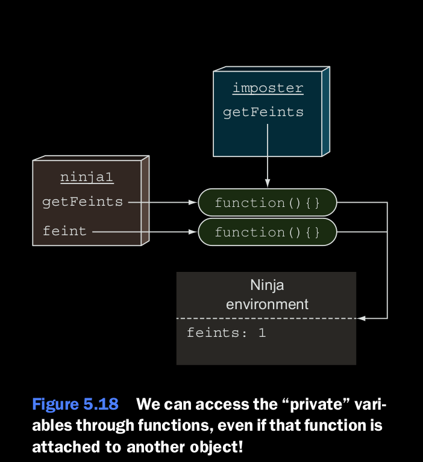

## Private variables caveat.

En Javascript, no hay nada que nos pueda parar de asignar propiedades creadas sobre un objeto a otro objeto. Por ejemplo, 
podemos facilmente reescribir el codigo del listing 5.11 dentro de algo como lo siguiente.

```
function Ninja() {
    var feints = 0;
    this.getFeints = function() {
        return feints;
    };
    this.feint = function() {
        feints++;
    }
}

var ninja1 = new Ninja;
ninja1.feint();

var imposter = {};
// Hace la funcion getFeints de ninja1 accesible a travez de imposter.
imposter.getFeints = ninja1.getFeints();

assert( imposter.getFeints() === 1, "The imposter has access to the feint variable");
```


Este listing modifica la fuente del codigo de una manera que asigna el metodo ninja1.getFeints a un nuevo objeto 
impostor. Despues, cuando llamamos a la funcion getFeints en el objeto imposter, testeamos de que podemos accesar el 
valor de la variable feints creada cuando ninja1 ha sido instanciado asi proveyendo que nosotros estamos falseando esta 
variable privada. Vea la figura 5.18.
Este ejemplo ilustra que no hay una variables privadas en un objeto en Javascript, pero que podemos crear clousures por 
medio de metodos de objetos que tengan suficiente, muchos desarrolladores encuentra de esta manera de esconder informacion 
importante.

```
<div id="box1">First Box</div>
<div id="box2">Second Box</div>


function assert(value, description) {
    var result = value ? "pass" : "fail";
    console.log(result + ' - ' +  description);
};


function animateIt(elementId) {
    var elem = document.getElementById(elementId);
    var tick = 0;
    var timer = setInterval( function () {
       if(tick < 100)
       {
           elem.style.left = elem.style.top = tick + "px";
           tick++;
       }
       else
       {
           clearInterval(timer);
           assert(tick === 100, "Tick accessed via clousure");
           assert( elem, "Element also accessed via a clousure");
           assert(timer, "Timer reference also obtained via a clousure");
       }
    }, 10);
}
animateIt("box1");
animateIt("box2");

```

Como usted vio mas temprano