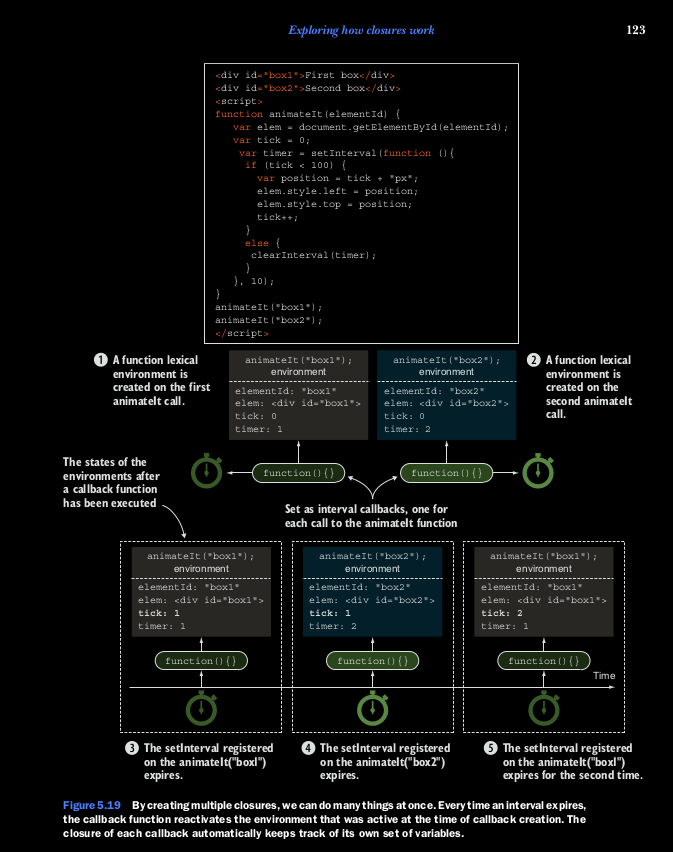

## Revisting the clusures and callbacks example

Vamos a volver a atras a nuestra simple animacion con callbacks con timers. Esta vez, vamos a animar dos objetos, como 
se muestra en el siguiente listing.

```
function assert(value, description) {
    var result = value ? "pass" : "fail";
    console.log(result + ' - ' +  description);
};


function animateIt(elementId) {
    var elem = document.getElementById(elementId);
    var tick = 0;
    var timer = setInterval( function () {
       if(tick < 100)
       {
           elem.style.left = elem.style.top = tick + "px";
           tick++;
       }
       else
       {
           clearInterval(timer);
           assert(tick === 100, "Tick accessed via clousure");
           assert( elem, "Element also accessed via a clousure");
           assert(timer, "Timer reference also obtained via a clousure");
       }
    }, 10);
}
animateIt("box1");
animateIt("box2");
```

Como usted pudo ver mas temprano, usamos clousures para simplificar animaciones y multiples objetos en nuestras paginas.
Pero ahora vamos a considerar los ambientes lexicos, como se muestra en la figura 5.19.
Cada vez que llamamos a la funcion animateIt, una nuevo ambiente lexico de una funcion es creado 1 2 que mantienen la 
pista de las variables importante para para la animacion (el elementId, elem, los elementos que empiezan a animar, tick 
el numero al corriente de ticks, y el timer, el ID del timer haciendo la Animacion). Ese ambiente va a mantener vivo 
siempre y cuando alla por lo menos una funcion que sirva con esas variables atravez de clousures. En este caso, el 
browser va a manter vivo el setInterval callback hasta que llamemos al clearInterval. Mas adelante, cuando un intervalo 
expra, el browser llama al matching callback -- y con el, a travez de clousures, vienen las variables definidas cuando 
el callback es creado. Esto habilita a evitar el problema de manualmente mapear el callback y las variables activas 
3 4 5, de este modo el codigo es simplificado significativamente.
Eso es todo lo que tenemos que decir acerca de los clousures y scopes. Ahora vamos a repasar este capitulo y vamos a 
conocer en el siguiente capitulo, donde vamos a explorar dos nuevos conceptos de ES6, los generadores y las promesas, 
esto nos sirve para cuando escribimos codigo asingcronico.


