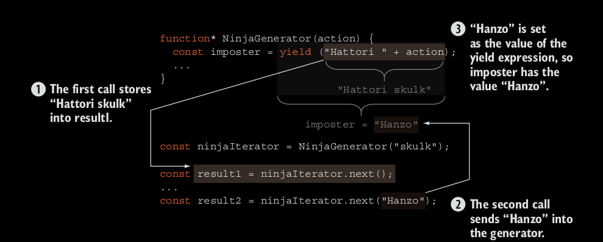

## Comunicando con un generador.

En los ejemplos presentados hasta ahora, usted ha visto como returnar valores multiples desde un generador al usar 
una expresion *yeild*. Pero los generadores son mas poderosas que eso! Tambien podemos enviar datos *a* un generador, 
por lo tanto al conseguir comunicacion bidireccional! Con un generador, podemos producir inmediatamente un resultado,
usar ese resultado para calcular algo mas desde afuera el generador, y despues, cuando quiera que este listo, enviar 
completamente una nueva data de vuelta al generador y resumir su ejecucion. Utilizaremos esta caracteristica para un 
gran efecto al final del capitulo para lidear con codigo asyncronico, pero por ahora, vamos a mantenerlo simple.

### Enviar valores como una funcion Generator
La forma mas facil de enviar datos a un generator es por medio de tratarlo como otra funcion y usar la llamada de la 
funcion como un callback. Vea el siguiente listing.

### Listing 6.8. Enviando datos a un recividor de datos de un generador.
```
function assert(value, description) {
	var result = value ? "pass" : "fail";
	console.log(result + ' - ' +  description);
}
// Un generador puede recivir argumentos estandares, como cualquier otra funcion

function* NinjaGenerator (action) {
	// La magia ocurre. Al hacer el yield al valor, el generador retorna
	// un calculo intermediario. Al llamar al iterador de el siguiente metodo
	// con un argument, enviamos de vuelta al generador
	const imposter = yield ("Hattori " + action);

	// El valor que se envia sobre el siguiente valor de la expresion yielded
	// entonces nuestro impostor es Hanzo.
	assert(imposter === "Hanzo", "El generador ha sido infiltrado");

	yield ("Yoshi ( " + imposter + ") " + action);
}

const ninjaIterator = NinjaGenerator("skulk");
const result1 = ninjaIterator.next();
// Hace trigger de la ejecionn de un generador y chequea que podamos obtener el valor correcto.
assert(result1.value === "Hattori skulk", "Hattori is skulking");

// Envia los datos a un generador como un argumento al sigiuente metodo y chequea
// si el valor es correctamente transferido.
const result2 = ninjaIterator.next("Hanzo");
assert(result2.value === "Yoshi (Hanzo) skulk", "We have an imposter!");
```
Una funcion reciviendo datos no es nada especial; simples funciones mas viejas que lo hace todo el tiempo. Pero 
recuerde, los generadores tienen inmeso poder; ellos pueden ser suspendidos y resumidos. Y se vuelve en torno hacia 
afuera, diferente a funciones standard, cuando resumimos entonces al hacer el request el valor next.

### Utiliznado el metodo next para enviar valores dentro un generador.

En adicion de proveer datos cuando se invoque por primera vez el generador, podemos enviar datos dentro un generador 
al pasar argumentos en el metodo *next()*. En el proceso, podemos despertar al generador de su suspencion y resumir 
su ejecucion. Este valor pasado en el metodo next() es usado por el generador como el valor de toda la expresion 
*yield*, en el cual el generador fue suspendida al corriente, como se muestra en la figura 6.3.

En este ejemplo, tenemos dos llamados al iterador ninjaIterator next(). El primer llamado, ninjaIterator.next(), hace un 
request al primer valor desde el generador. Por que nuestro generador no ha empezado ha ser ejecutado, esta llamada 
inicializa el generador, el cual calcula el valor de la rexpresion "Hattori " + action, hace un yield al valor 
*Hattori skulk*, y suspende a la ejecucion del generador. No hay nada especial sobre esto, hemos hecho algo similar 
muchas veces a lo largo de este capitulo.

Lo mas interesante que esta pasando en el segundo llamado al *ninjaIterator's* con el metodo next(): 
ninjaIterator.next('Hanzo'). A este momento, estamos usando el metodo next() al pasar el dato



La figura 6.3: El primer llamado al ninjaIterator.next() hace un request un nuevo valor desde el generador, que retorna 
*Hattori skulk* y suspende la ejecucion del el generador en la expresion *yield*. El segundo llamdo *Hanzo* dentro de 
el generador. Este valor va ser usado como el valor de todo la expresion *yield*, y la variable imposter ahora va tener 
el valor de *Hanzo*.

Asi es como logramos comunicacion biridiccional  con un generador. Usamos *yeld* para retonar datos del el 
generador, y el iterador del metodo next() para pasar datos al generador.

NOTA: El metodo next() nos da el valor del *yield* en espera, entonces si no hay un *yield* esperando, no hay nada que 
podamos suplementar el valor. Por esta razon, no podemos suplementar valores sobre la primera llamada con el metodo 
next(). Pero recuerde, si usted necesita suplementar un valor inicial al generador, usted puede cuando llama al 
generador a si mismo, como hicimos con el NinjaGenerator("skulk").

### Enviando Excepciones

Hay otra manera menos ortodoxa, una manera de suplementar un valor a un generador, al lanzar una exepcion. Cada 
iterador, en adicion de tener el metodo next(), como un metodo que lanza excepciones de vuelta al generador. De nuevo, 
vamos a ver un simple ejempo

#### Listing 6.9 Lanzando excepciones a generadores.
```
function assert(value, description) {
	var result = value ? "pass" : "fail";
	console.log(result + ' - ' +  description);
}
function* NinjaGenerator() {
	try{
		yield "Hattori";
		fail("The expected execption didnt occur");
	} catch (e) {
		assert(e === "Catch this !", "Aha ! we caought an exeption");
	}
}

const ninjaIterator = NinjaGenerator();
const result1 = ninjaIterator.next();
assert(result1.value === "Hattori", "We got Hattori");
ninjaIterator.throw("Catch this");
```
El listing 6.9 empieza similar al listing 6.8 al especificar un generador llamado NinjaGenerator. Pero esta vez, el 
body de el generator es un poco diferente. Lo hemos envuelto en un bloque try-catch:

```
function* NinjaGenerator() {
	try{
		yield "Hattori";
		fail("The expected execption didnt occur");
	} catch (e) {
		assert(e === "Catch this !", "Aha ! we caought an exeption");
	}
}

```

Despues continua al crear un iterador, y obteniendo un vaor de el generador: 
```
const ninjaIterator = NinjaGenerator();
const result1 = ninjaIterator.next();
```
Finalmente, usamos un metodo throw, avilitado para todos los iteradores, para lanzar una excepcion de vuelta al 
generador.

```
ninjaIterator.throw("Catch this!");
```
Al correr este listing, vamos a obtener nuestra excepcion como esperavamos en la figura 6.4.
```
pass - We got Hattori
generator_exceptions.js:3 fail - Aha ! we caought an exeption
```

Esta caracteristica que nos permite lanzar exepciones de vuelta a los generadores talvez parezca algo extrano al 
principio. Por que hariamos algo como esto? No se preocupe, no lo vamos a mantener en la oscuridad. Al final de este 
capitulo usaremos esta caracteristica para mejorar el modo asyncronico del lado servidor. Solo sea un poco mas pasciente.
Ahora que usted ha visto muchos aspectos de los generadores, estamos listmos a tomar una mirada bajo la manga para 
ver como los generadores funcionan.