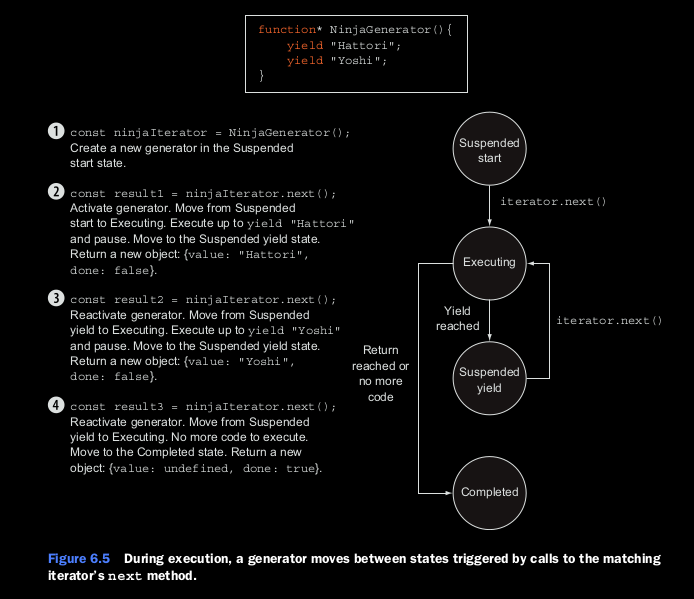
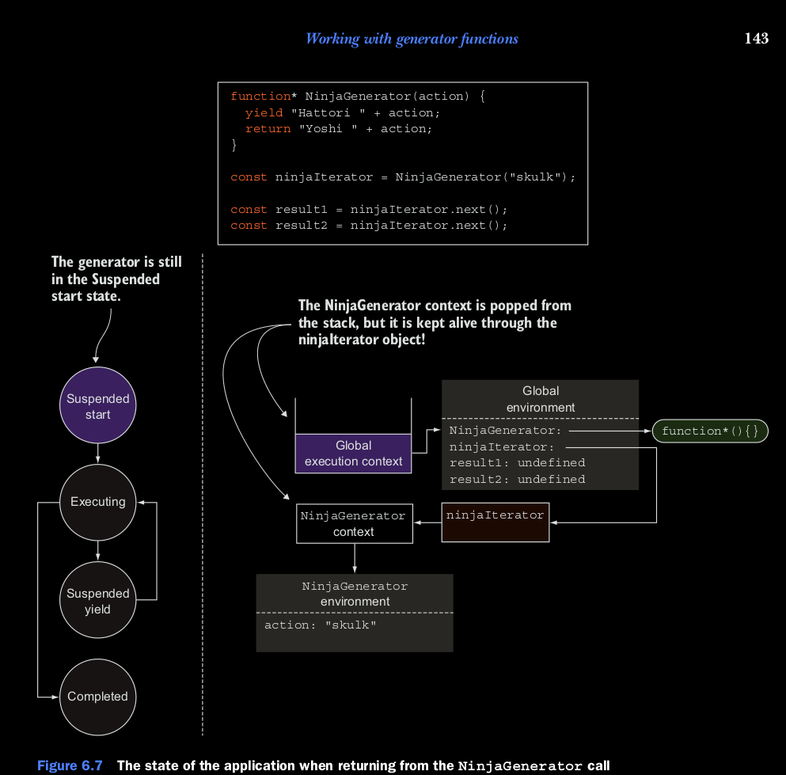
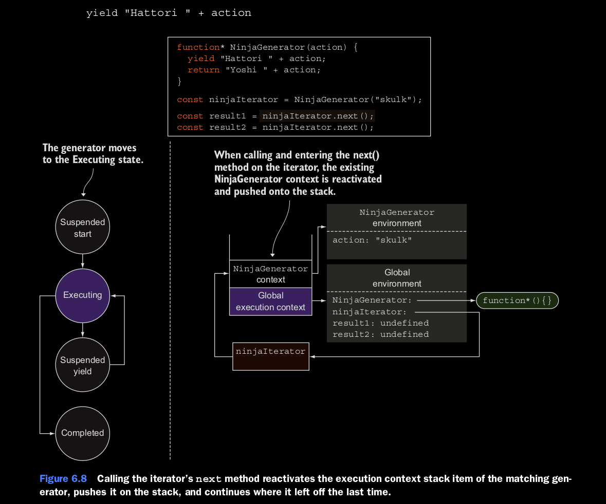
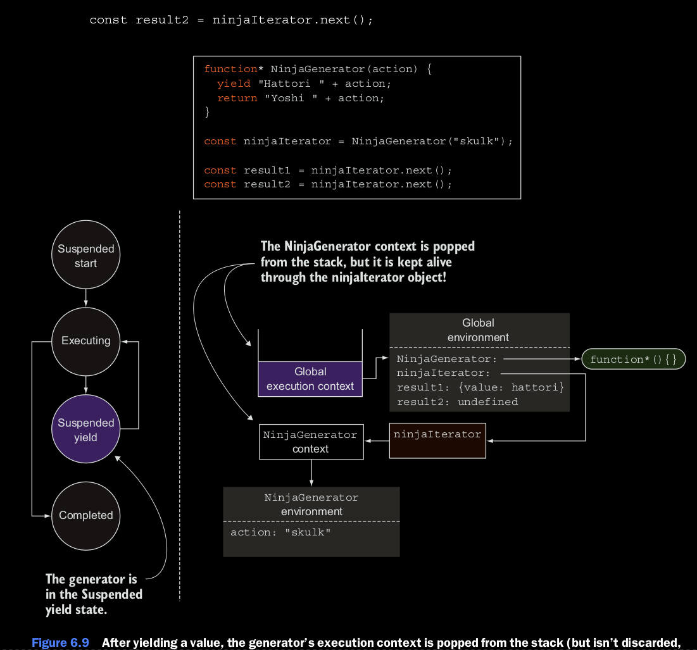

## Exploring generators debajo del capo.
Hasta ahora sabemos que al llamar a un generador no se ejecuta. En vez de eso, crea un nuevo iterador que podemos 
usar para hacer un request de valores desde el generador. Despues de que un generador produce o hace un *yield*, se 
suspende su ejecucion y espera por el siguiente request. De alguna manera, un generador funciona como un pequeno 
programa, un estado en la maquina que se mueve entre estados.

* Suspended start: Cuando el generador es creado, empieza en este estado. Ninguno del codigo del generador es 
ejecutado.

* Ejecutandose: El estado en el cual el codigo del generador es ejecutado. La ejecucion continua ya se desde el 
principio o desde donde el generador fue suspendido. Un generador se mueve ha este estado cuando el interador hace 
match utiizando el metodo next(), y despues existe codigo para ser ejecutado.

* yield suspendido: Durante la ejecucion , cuando el generador alcanza a la expresion yield, crea un nuevo objeto que 
lleva el valor que va a retonar, hace un yield, y suspende la ejecucion. Este es el estado es en el que el generador 
es pausado y esta esperando para continuar con la ejecucion.

* Completado: Si durante la ejecucion el generador una de dos corre dentro un estado de return o corre fuera de la 
ejecucion del codigo.

### Figura 6.5 ilustra este estado.

Ahora vamos a ver esto de una manera mas profunda, al ver como la ejecucion de los generadores es seguida con el 
contexto de la ejecucion.


Durante la ejecucion, un generador se mueve entre estados disparados por medio de llamados que iguale al interador 
con el metodo next().

### Rastreo de Generadores con el contexto de ejecucion.
En el capitulo anterior, vamos a introducir el contexto de ejecucion, un mecanismo interno de Javascript usado para 
rastrear la ejecucion del contexto. vamos a empezar con una fraccion de codigo

```
function* NinjaGenerator(action){
    yield "Hattori " + action;
    return "Yoshi " + action;
}
const ninjaIterator = NinjaGenerator("skulk");
const result1 = ninjaIterator.next();
const result2 = ninjaIterator.next();
```

Aqui reutilizamos nuestro generador que produce dos valores: *Hatori skulk* y *YOSHI skulk*.

Ahora, vamos a explorar el estado de la aplicacion, la ejecucion del contexto de pila en varios puntos en la ejecucion 
de la aplicacion. La primera imagen muestra en dos posiciones en la ejeucion de aplicacion. Antes de llamar al generador 
la funcion NinjaGenerator(). (1)  Por que estamos ejecutando codigo global, el contexto de ejecucion de pila contiene, 
el cual referencia el ambiente global en donde nuestros indentificadores se mantienenen. Solo el NinjaGenerator 
identificador mantiene. Solo el identificador NinjaGenerator referencia una funcion, mientras los valores de todos los 
otros identificadores son *undefined*.

Cuando hacemos el llamado a la funcion NinjaGenerator (2).
```
const ninjaIterator = NinjaGenerator("skulk");
```
el flujo de control entra en el generador y, como pasa cuando entramos en cualquier otra funcion, una nueva ejecucion 
de contexto de la funcion NinjaGenerator es creada (junto al pareo del ambiente lexico) y es empujado hacia el stack. 
Pero por que los generadores son especiales, ninguna de las funciones es ejecutada. En vez de eso, un nuevo iterador, 
que va hacer referencia dentro del codigo como ninjaIterator, es creado y retornado. Por que el iterador es usado como 
control de la ejecucion del generador. el iterador obtiene una referencia al contexto de ejecucion en el cual es creado.

Una cosa interesante pasa cuando la ejecucion del programa deja el generador, como se muestra en la figura 6.7.
Tipicamente, cuando la ejecucion del programa retorna como una funcion standard, el pareo de el contexto de ejecucion
revianta del stack y es completamente descartado. Pero este no es el caso con generadores.




El pareo en el NinjaGenerator stack item estalla del stack, pero no esta descartado, por que el ninjaIterator una 
referencia. Usted lo puede ver como un clousure analogo. En clousures, necesitamos mantener vivo las variables que estan 
vivas al momento en que el clousure de la funcion es creada, entonces nuestras funciones mantienen una referencia al 
ambiente al cual han sido creados. De esta manera, nos aseguramos que el ambiente y sus variables estan vivas siempre y 
cuando se mantenga la funcion. Los Generadores, por otra parte, tiene que ser capaz de reanudar su ejecucion. Por que la 
ejecucion de todas las funciones es manejada por el contexto de ejecucion, el iterador mantiene una referencia para su 
contexto de ejecucion, para que este vivo siempre que iterador lo necesite.

Otra cosa interesante que pasa cuando llamamos al siguente metodo en el iterador:

```
const result1 = ninjaIterator.next();
```

Si esto fuera una llamada de una funcion standard, esto causaria la creacion de un de una nueva ejecucion next(), el 
cual se pondra en el stack. Pero como usted habra notado, los Generators no son Standard, y una llamada al metodo 
next() de un iterador se comporta diferente. Reactiva a ejecucion correspondiente al contexto, en este caso, el contexto 
NinjaGenerator, y pone en el top del stack, continuando la ejecucion donde quedo apagada, como se muestra en la figura 6.8.

En la figura 6.8 ilustra una diferencia crucial entre funciones standard y generators. Las funciones standard solo pueden 
ser llamadas de nuevo, y cada llamada crea un nuevo contexto de ejecucion. En contraste, el contexto de ejecucion de un 
generator puede ser suspendida y reiniciada de nuevo.

En nuestro ejempo, por que esta es la primera llamada al metodo next(), y el generator no se ha empezado a ejecutar, el 
generator se empieza a ejecutar y se mueve a un estado de ejecucion. La siguiente cosa interesante que pasa cuando cuando 
el generator alcanza el siguiente punto:



El Generator determina que la expresion igual a *Hattori skulk*, y la evaluacion alcanza la palabra *yeild*. Esto significa 
que *Hattori skulk* es el primer resultado intermediario de nuestro generador y el cual queremos suspender a ejecucion de 
el generador y retonar un valor. En terminos de el estado de a aplicacion, una cosa similar pasa como anteriormente paso: 
el contexto de NinjaGenerator es tomado suspendido en el stack, pero no ha sido complementamente descartado, por que el 
ninjaIterator mantiene una referencia. El generador es ahora suspendido, y ha sido movido a un estado de el Yield Suspendido,
sin generar un bloqueo. La ejecucion del programa se reuanuda en el codigo Global, al guardar el valor que ha sido yielded en
result1.
El estado al corriente de la aplicacion es mostrado en la figura 6.9.

El codigo continua al alcanzar otra llamada del iterador.



En este punto, vamos a travez de todo el proceso de nuevo: reactivamos el contexto de la funcion NinjaGenerator referenciado 
por el ninjaIterator, lo empuja al stack, y continua su ejecucion donde fue dejada apagada. En este cas, el generador 
evalua la expresion *Yoshi + action*. Pero en esta ocacion no hay una expresion *yeild*, y en vez de eso el programa se 
encuentra un return. Este retorna el valor de *Yoshi skulk* y completa la ejecucion del generator al mover al genrador en 
un estado de completado.
Vimos profundamente como los generators funcionan para mostrarle todos los beneficios de los generadores tienen efectos 
secundarios con el hecho que el contexto de ejecucion mantiene vivo si hacemos un yield a un generator, y no destruida 
como en el caso con valores restornados en funciones standards.
Ahora recomendamos que usted tome un descanso para continuar en el segundo ingrediente requerido para escribir codigo 
asyncronico elegante.


 


