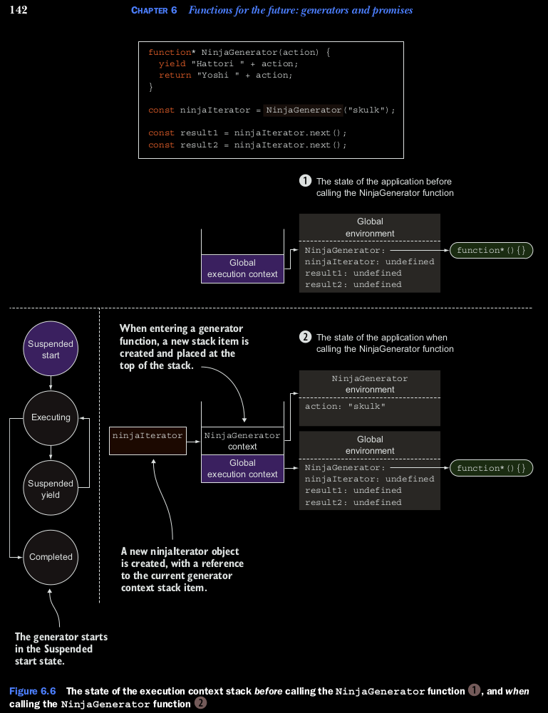

## Exploring generators debajo del capo.
Hasta ahora sabemos que al llamar a un generador no se ejecuta. En vez de eso, crea un nuevo iterador que podemos 
usar para hacer un request de valores desde el generador. Despues de que un generador produce o hace un *yield*, se 
suspende su ejecucion y espera por el siguiente request. De alguna manera, un generador funciona como un pequeno 
programa, un estado en la maquina que se mueve entre estados.

* Suspended start: Cuando el generador es creado, empieza en este estado. Ninguno del codigo del generador es 
ejecutado.

* Ejecutandose: El estado en el cual el codigo del generador es ejecutado. La ejecucion continua ya se desde el 
principio o desde donde el generador fue suspendido. Un generador se mueve ha este estado cuando el interador hace 
match utiizando el metodo next(), y despues existe codigo para ser ejecutado.

* yield suspendido: Durante la ejecucion , cuando el generador alcanza a la expresion yield, crea un nuevo objeto que 
lleva el valor que va a retonar, hace un yield, y suspende la ejecucion. Este es el estado es en el que el generador 
es pausado y esta esperando para continuar con la ejecucion.

* Completado: Si durante la ejecucion el generador una de dos corre dentro un estado de return o corre fuera de la 
ejecucion del codigo.

### Figura 6.5 ilustra este estado.

Ahora vamos a ver esto de una manera mas profunda, al ver como la ejecucion de los generadores es seguida con el 
contexto de la ejecucion.


Durante la ejecucion, un generador se mueve entre estados disparados por medio de llamados que iguale al interador 
con el metodo next().

### Rastreo de Generadores con el contexto de ejecucion.
En el capitulo anterior, vamos a introducir el contexto de ejecucion, un mecanismo interno de Javascript usado para 
rastrear la ejecucion del contexto. vamos a empezar con una fraccion de codigo

```
function* NinjaGenerator(action){
    yield "Hattori " + action;
    return "Yoshi " + action;
}
const ninjaIterator = NinjaGenerator("skulk");
const result1 = ninjaIterator.next();
const result2 = ninjaIterator.next();
```

Aqui reutilizamos nuestro generador que produce dos valores: *Hatori skulk* y *YOSHI skulk*.

Ahora, vamos a explorar el estado de la aplicacion, la ejecucion del contexto de pila en varios puntos en la ejecucion 
de la aplicacion. La primera imagen muestra en dos posiciones en la ejeucion de aplicacion. Antes de llamar al generador 
la funcion NinjaGenerator(). (1)  Por que estamos ejecutando codigo global, el contexto de ejecucion de pila contiene, 
el cual referencia el ambiente global en donde nuestros indentificadores se mantienenen. Solo el NinjaGenerator 
identificador mantiene. Solo el identificador NinjaGenerator referencia una funcion, mientras los valores de todos los 
otros identificadores son *undefined*.

Cuando hacemos el llamado a la funcion NinjaGenerator (2).
```
const ninjaIterator = NinjaGenerator("skulk");
```
el flujo de control entra en el generador y, como pasa cuando entramos en cualquier otra funcion, una nueva ejecucion 
de contexto de la funcion NinjaGenerator es creada (junto al pareo del ambiente lexico) y es empujado hacia el stack. 
Pero por que los generadores son especiales, ninguna de las funciones es ejecutada. En vez de eso, un nuevo iterador, 
que va hacer referencia dentro del codigo como ninjaIterator, es creado y retornado. Por que el iterador es usado como 
control de la ejecucion del generador. el iterador obtiene una referencia al contexto de ejecucion en el cual es creado.

Una cosa interesante pasa cuando la ejecucion del programa deja el generador, como se muestra en la figura 6.7.
Tipicamente, cuando la ejecucion del programa retorna como una funcion standard, el pareo de el contexto de ejecucion
revianta del stack y es completamente descartado. Pero este no es el caso con generadores.




