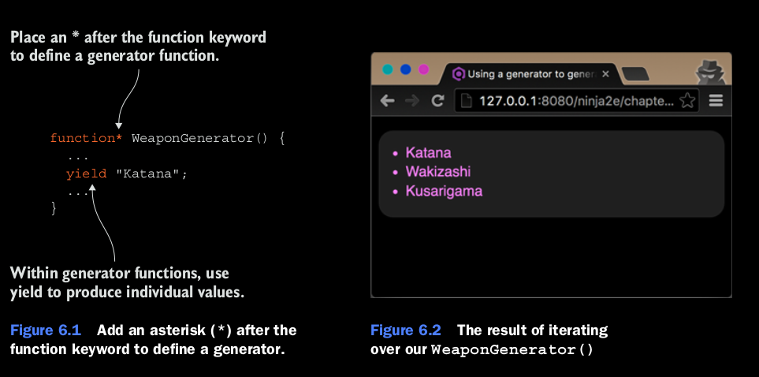

## Working with generator functions

Los generadores son completamente un nuevo tipo de funcion y es significantemente diferente de las funciones standard,
run-of-the-mill functions. Un generator es una funcion que genera secuencias de valores, pero no todo al mismo tiempo,
como una funcion standard lo haria, pero basado en request. Tenemos que preguntarle explicitamente al generador 
por un nuevo valor, y el generador va a responder o con valor o va a notificar que no hay mas valores que producir.
Lo que es mas curioso es que despues de que un valor es producido, una funcion generator no termina de ejecutarse, como 
una funcion normal lo haria. En vez de eso, un generador es meramente suspendido. Despues cuando un request por otro 
valor viene por si mismo, el generador resume del momento donde se quedo hasta ese moento.
El siguiente listing provee un ejemplo simple de utilizar generadores para generar una secuencia de armas.

### Listing 6.1 Using generator function to generate a sequeses of values.

```
function assert(value, description) {
    var result = value ? "pass" : "fail";
    console.log(result + ' - ' +  description);
};
//Define una funcion generator al poner *  despues de la palabra function.
function* WeaponGenerator () {
    // Estos Yields Generan valores individuales al usar la nueva palabra yield.
    yield "Katana";
    yield "Wakizashi";
    yield "Kurasigama";
}

for (let weapon of WeaponGenerator())
{
    assert(weapon !== undefined, weapon);
}
```

Empezamos al definir el generator que va a producir una secuencia de armas. Crear una funcion generator. Creando una 
funcion generator es simple. Agregamos el asterisco (*) despues de la palabra funcion. Esto permite una nueva palabra 
*yield* dentro del cuerpo de la funcion generator para producir valores individuales. La figura 6.1 ilustra la sintaxis.
En este ejemplo, cramos un generador llamado WeaponGenerator que produce una secuencia de armas: Katana, Wakizashi y 
Kusarigama. Una forma de consumir esa secuencia de armas es al usar una nueva forma de loop, el for-of loop:

```
for (let weapon of WeaponGenerator())
{
    assert(weapon !== undefined, weapon);
}
```

El resultado de invocar un loop *for-of*  es mostrado en la figura 6.2 (Por ahora, no se preocupe mcuho acerca del for-of 
loop, lo vamos a explorar mas tarde).



A mano derecha del *for-of*  loop, hemos puesto el resultado de invocar nuestra funcion generator. Pero si usted toma una 
mirada mas cercana en el cuerpo de la funcion Weapongenerator, usted vera que no es un return. Que pasa con eso? En este 
caso, no deberia a mano derecha del *for-of* loop evaluar *undefined*, si fuera el caso que estuvieramos lideando con 
una funcion de la funcion standard?
La verdad es que los generatos son un poco diferentes a las funciones standards. Para los que estan empezando, llamar a una 
funcion generator no ejecuta la funcion generator; en vez de eso crea un objeto llamado iterador. Vamos A explorar ese 
objeto.
