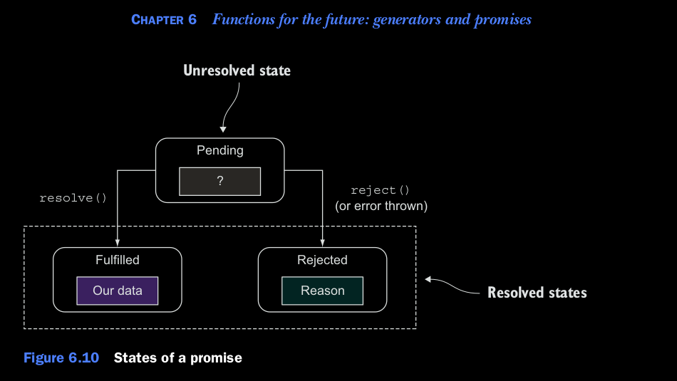
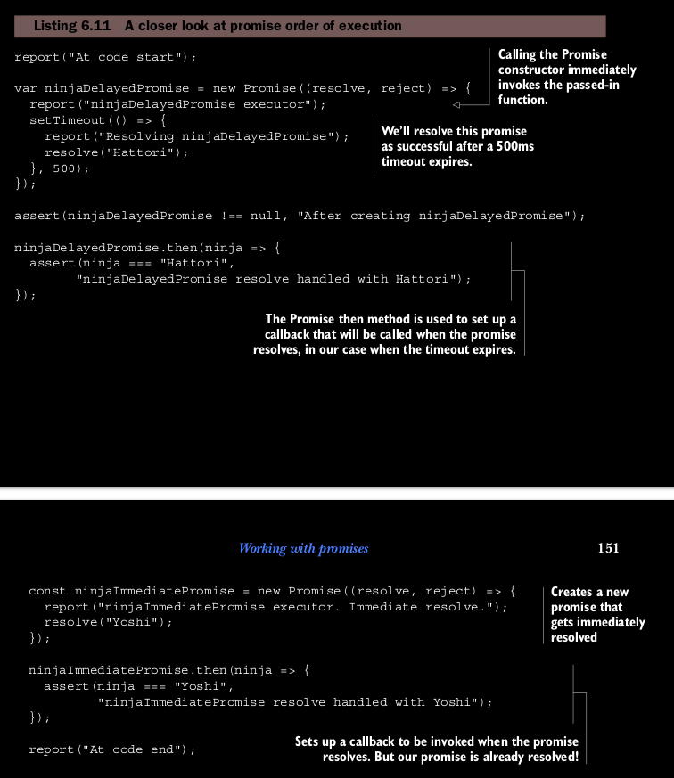

### Diving into promises.

Una promesa es un objeto que sirve como un marcador de posición para un resultado de una tarea asyncronica. Representa 
un valor que no tenemos pero esperamos obtener en el futuro. Por esta razon, durante su ciclo de vida, por esta razon 
una promesa puede pasar por varios estados como se muestra en la figura 6.10.
Una Promesa empieza en el estado de *pending state*, en el cual no sabemos nada del valor de nuestra promesa.
Durante la ejecucion del programa, si la function Promise *resolve* es llamada, la promesa se mueve al *fullfilled* state.
Por otro lado, si una funcion promise *reject* es llamada o obtiene una exepcion no manejada durante el manejo de la 
promesa, la promesa se mueve a un estado de *rejected*, en el cual no fue posible obtener el valor de la promesa, pero 
en el cual al menos sabremos por que. Una vez que una promesa ha alcanzado su estado de *fullfilled* o el estado de 
*rejected*, no se puede cambiar (una promesa no puede ir de un estado *fullfied* a un estado *rejected* o viseversa), 
y siempre se mantiene en el estado en que quedo. Decimos que una promesa es resuelta. (ya sea satisfactoriamente o no).


 
### Listing 6.11 Una Mirada Cercana al orden de ejecucion en una promesa

la promesa se traslada al estado de cumplimiento, en el que hemos obtenido con éxito la promo-
valor ised Por otro lado, si se llama a la función de rechazo de la promesa, o si
se produce una excepción no controlada durante el manejo de la promesa, la promesa se mueve hacia
el estado rechazado, en el que no pudimos obtener el valor prometido, pero en el cual
al menos sabemos por qué. Una vez que una promesa ha alcanzado el estado cumplido o el
estado rechazado, no puede cambiar (una promesa no puede ir de cumplida a rechazada o viceversa).
versa), y siempre se mantiene en ese estado. Decimos que una promesa se resuelve
con éxito o no).



El código en el listado 6.11 genera los resultados que se muestran en la figura 6.11. Como puedes ver, la
el código comienza registrando el mensaje "At code start" utilizando nuestro informe personalizado
Función (apéndice C) que muestra el mensaje en pantalla. Esto nos permite fácilmente
Seguimiento del orden de ejecución.

A continuación creamos una nueva promesa llamando al constructor Promise. Esta inmediadamente
 invocada la función ejecutora en la que configuramos un tiempo de espera:
 
 ```
 setTimeout(() => {
     report("Resolving ninjaDelayedPromise");
     resolve("Hattori");
 }, 500);
 ```
 
 El tiempo de espera resolverá la promesa después de
 500ms. Esto podría haber sido cualquier otro
 Tarea asíncrona, pero elegimos la
 Tiempo de espera humilde por su sencillez.
 
 Después de que el ninjaDelayedPromise haya
 creado, todavía no sabe la
 valor que eventualmente tendrá, o
 si incluso será exitoso
 (Recuerda, todavía está esperando el tiempo de espera que lo resolverá). 
 Así que después de la construcción, la promesa de demora del ninja está en el
 Primer estado de promesa, pendiente.
 
 A continuación utilizamos el método then en el
 ninjaDelayedPromise para programar un
 La devolución de llamada se ejecutará cuando la promesa se resuelva con éxito:
 
 Esta devolución de llamada siempre se llamará de forma asíncrona, independientemente del estado actual de
 la promesa.
 
 Continuamos creando otra promesa, ninjaImmediatePromise, que es
 Resuelto inmediatamente durante su construcción, llamando a la función de resolution. diferente a
 el ninjaDelayedPromise, que después de la construcción se encuentra en estado pendiente, 
 el ninjaImmediatePromise termina la construcción en el estado resuelto, y la promesa ya está
 tiene el valor de Yoshi.
 
 Luego, usamos el método de ninjaImmediatePromise para registrar una llamada
 Volver que se ejecutará cuando la promesa se resuelva con éxito. Pero nuestra promesa es
 ya establecido ¿Significa esto que la devolución de llamada de éxito se llamará inmediatamente o
 que será ignorado? La respuesta es ninguna.
 
 Las promesas están diseñadas para hacer frente a acciones asíncronas, por lo que el motor de JavaScript
 Siempre recurre al manejo asíncrono, para hacer predecible el comportamiento de promesa.
 El motor hace esto ejecutando las devoluciones de llamada luego de todo el código en el actual
 Se ejecuta el paso del ciclo de eventos (una vez más, exploraremos exactamente lo que esto significa
 en el capítulo 13). Por esta razón, si estudiamos el resultado en la figura 6.11, veremos que
 primero registra "Al final del código" y luego registramos que se resolvió el ninjaImmediatePromise.
 Al final, después de que el tiempo de espera de 500 ms caduque, se resuelve la promesa ninjaDelayedPromise,
 lo que provoca la ejecución de la devolución de llamada correspondiente y luego.
 
 Al final, después de que el tiempo de espera de 500 ms caduque, se resuelve la promesa ninjaDelayedPromise,
 lo que provoca la ejecución de la devolución de llamada correspondiente y luego.
 
 En este ejemplo, en aras de la simplicidad, hemos trabajado solo con el escenario optimista
 en el que todo va bien. Pero el mundo real no es todo sol y arco iris, así que
 vamos a ver cómo lidiar con todo tipo de problemas locos que pueden ocurrir.
 
 
 
 


